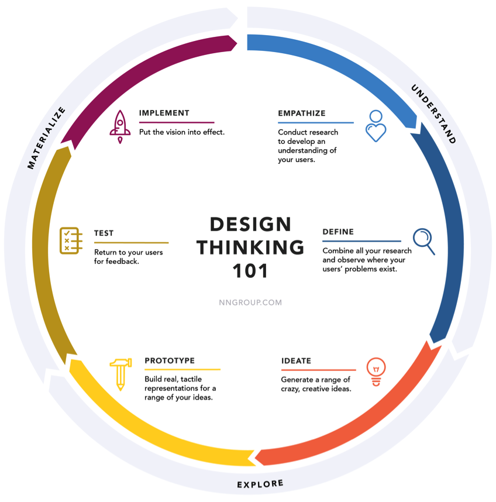
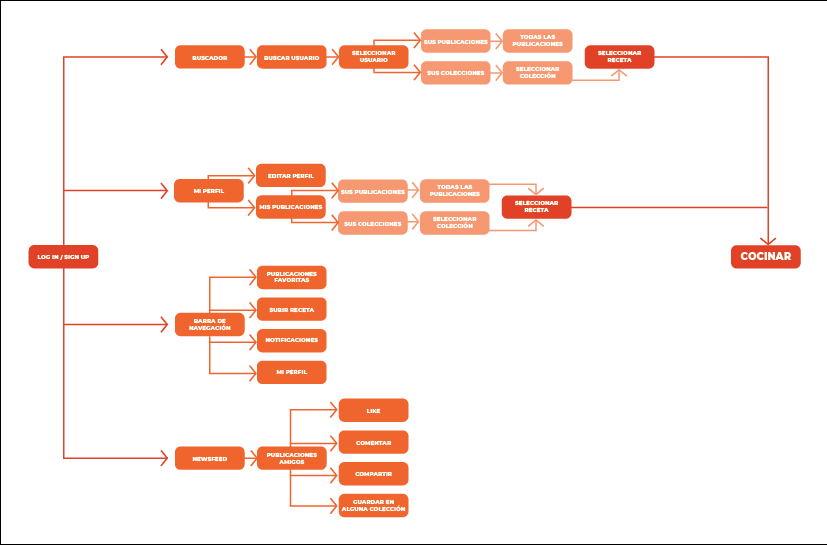
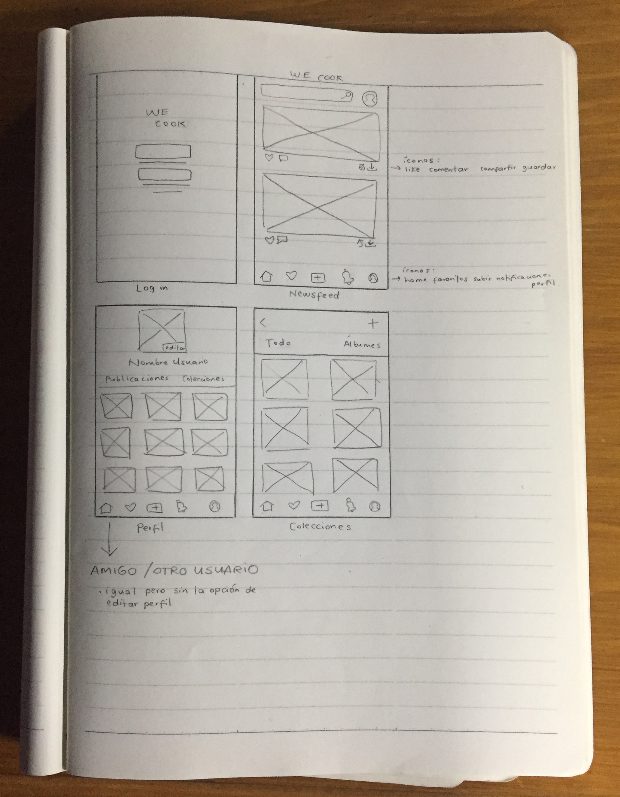
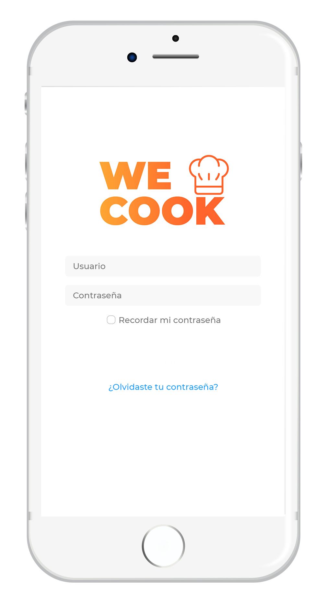
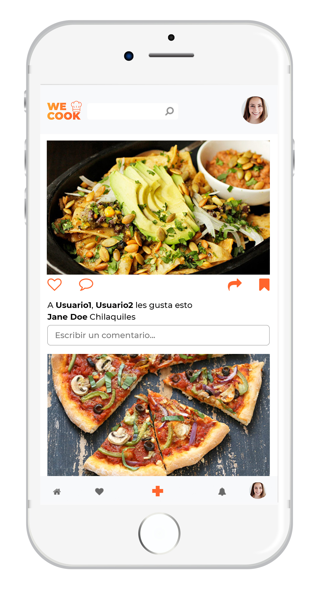
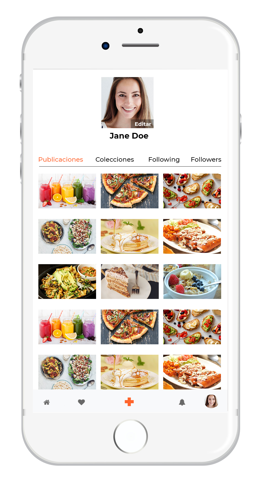
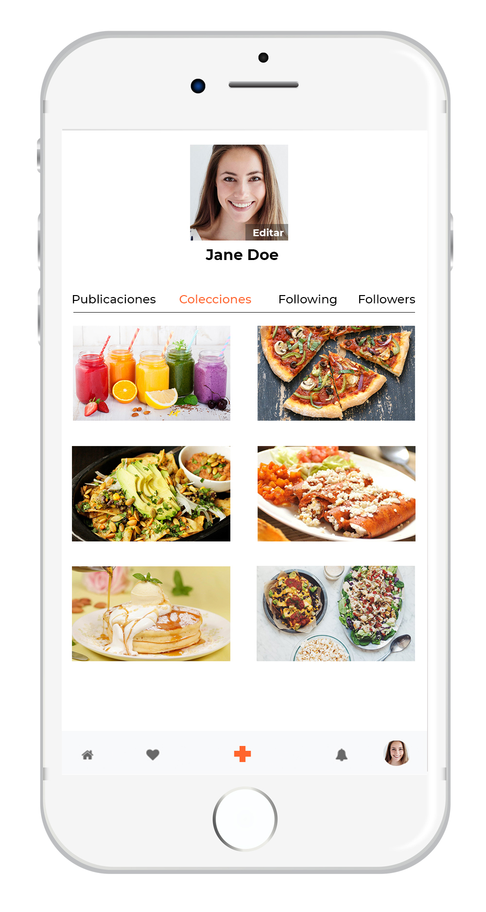
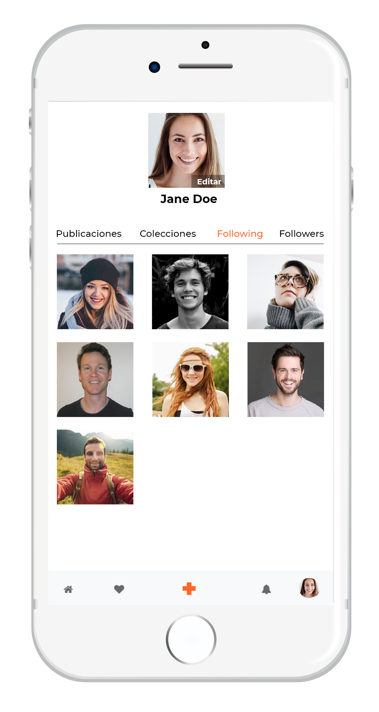
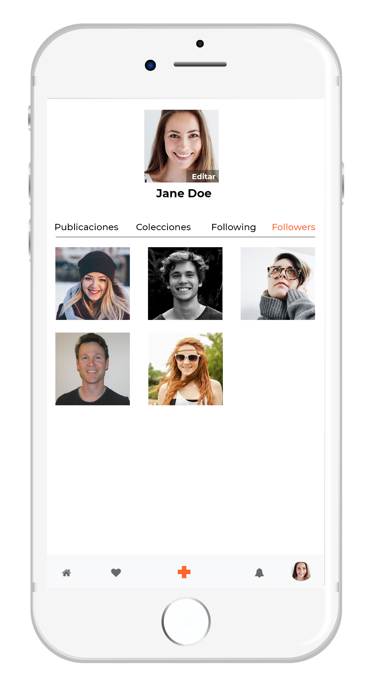
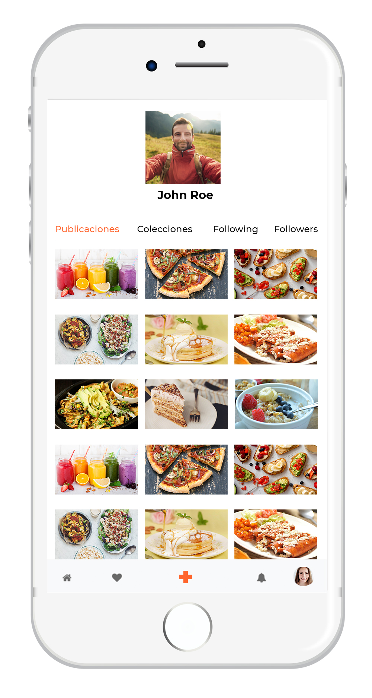

# PRODUCTO FINAL
### WE COOK red social

#### Objetivos
1. Crear una app que solucione el problema de la gente que no sabe cocinar o necesita inspiración para preparar cosas nuevas, dentro de una red social.
2. Construir un prototipo para testear las ideas.
3. Implementar las ideas en un proyecto final.

Ayudarnos a lograr los objetivos en base al modelo de Design Thinking:

#### Empatizar
Se entrevistó a personas con un rango de edad de 20 a 50 años, preguntándoles si les sería de utilidad una red social que les ayude a ver, guardar, crear y compartir recetas de cocina con amigos y followers

Se seleccionaron hombres y mujeres, con diferentes niveles de experiencia en la cocina y con una o más redes sociales.

#### Definir
Al hacer las entrevistas, nos dimos cuenta de los pain points:
1. Encontramos 2 tipos de personas; una que es inexperta y busca recetas simples y otra que tiene más experiencia, pero busca inspiración y tiene ganas de compartir sus recetas favoritas.
2. Dentro de la gente que es inexperta, se halló que tiene más confianza en intentar algo que le recomiendan cocinar sus amigos, pues si intentar hacer la receta, saben a quien preguntarle por dudas.
3. A los dos tipos de personas les parece atractiva la idea de una red social donde puedan ver recetas de amigos y gente que siguen, guardar en álbumes que ellos personalicen, subir sus recetas favoritas y compartir con sus amigos y/o followers. Además de que no quieren invertir tiempo en aprender como se usa una red social.

#### Idear
Arquitectura de la información:

#### Prototipar
Se creo un prototipo en papel para testear con los usuarios:

#### User testing
Después de crear el prototipo, se mostró a los usuarios y checamos si nuestras propuestas en la arquitectura de la información eran válidas y aceptadas.

#### Implementación
Después de haber sido validado, se procede a la implementación, con los siguientes puntos:
1. Diseño visual:
  - Se propone manejar una interfaz minimalista ya que pueden hacer múltiples tareas con un diseño limpio y con menos pasos.
  - Usar el naranja para la identidad de la marca, ya que este es un color energético y cálido. Combina el poder del rojo y la amabilidad del amarillo, por lo que puede traer sentimientos de motivación y entusiasmo, así como dan espíritu de creatividad y aventura. Justo lo que WE COOK busca representar.

En base a eso se implementan los siguientes colores:
-  `#ff652c`
-  `#FDA634`

El logo:

Tipografía: Montserrat 

Sketch:

